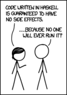

---
header-includes:
  \usetheme{Warsaw}
  \setbeamercolor{normal text}{fg=white,bg=black!90}
  \setbeamercolor{structure}{fg=white}
  \setbeamercolor{alerted text}{fg=red!85!black}
  \setbeamercolor{item projected}{use=item,fg=black,bg=item.fg!35}
  \setbeamercolor*{palette primary}{use=structure,fg=structure.fg}
  \setbeamercolor*{palette secondary}{use=structure,fg=structure.fg!95!black}
  \setbeamercolor*{palette tertiary}{use=structure,fg=structure.fg!90!black}
  \setbeamercolor*{palette quaternary}{use=structure,fg=structure.fg!95!black,bg=black!80}
  \setbeamercolor*{framesubtitle}{fg=white}
  \setbeamercolor*{block title}{parent=structure,bg=black!60}
  \setbeamercolor*{block body}{fg=black,bg=black!10}
  \setbeamercolor*{block title alerted}{parent=alerted text,bg=black!15}
  \setbeamercolor*{block title example}{parent=example text,bg=black!15}

author: Cameron Reuschel - Vincent Truchseß
title: Curry time - Learn you a Haskell
---
# Wat the haskell?

## Intro

###


###


### A pure functional Programming Language

  * Everything immutable
  * Everything is lazy
  * Everything is a function

## Getting started

### Tools

  * GHC - The Glasgow Haskell Compiler
  * A mature editor (e.g. vim)
  * REPL-Integration (e.g. vim-slime for vim users)

### Soak, Wash, Rinse, Repeat - The REPL

# Functions

## Basics

### 

## More on Functions

### Currying

### Higher order Functions

### Lambda Expressions

# Types

## Basic Types

###

## Lists

### Creating Lists

### Working on lists

### Infinite Lists

### Data Types

## Type Classes

# Dealing with Side Effects

## Side Effects

### What is a Side Effect?

[columns]

[column=0.5]

*Any operation which modifies the state of the computer or which interacts with the outside world*

\ 

* variable assignment
* displaying something
* printing to console
* writing to disk
* accessing a database

[column=0.5]



[/columns]

### Dealing with Side Effects

* Haskell is **pure**: There are no side effects
* But every program interacts with its environment in some way
* The `IO` monad *describes* an interaction with the environment
* Descriptions can be *composed* through the *bind* operator `>>=`
* The `main` function in Haskell returns an `IO ()` which describes the sum of all side effects to be executed by the Haskell runtime

### Simulating imperative programming

```haskell
putStrLn :: String -> IO ()
getLine :: IO String
```

```haskell
getLine >>= (\firstLine -> 
  getLine >>= (\secondLine -> 
    putStrLine (firstLine ++ secondLine)
      >> putStrLine "Done."))
```

```haskell
do
  firstLine <- getLine 
  secondLine <- getLine
  putStrLine $ firstLine ++ secondLine
  putStrLine "Done."
```

### Example

`getLine` yields an `IO String` which describes how to *later* yield a string by executing controlled side effects:

\ 

```haskell
takeLinesUntil :: (String -> Bool) -> IO [String]
takeLinesUntil predicate = go predicate []
  where
    go predicate lines = do
      line <- getLine
      if predicate line
        then return $ reverse lines
        else go predicate $ line : lines
```

### Main method

```haskell
main :: IO ()
main = do
  args <- getArgs
  putStrLn "\nEnter code and input:\n"
  codeLines <- takeLinesUntil null
  let singleLineCode = intercalate "" codeLines
  let (code, input) = parseInput singleLineCode
  case validateBrackets code of
    TooManyOpen -> putStrLn tooManyOpenError
    TooManyClosed -> putStrLn tooManyClosedError
    NoCode -> putStrLn noCodeError
    Fine -> do
      let out = interpretCode code input
      putStrLn "Output:\n"
      putStrLn out
```

